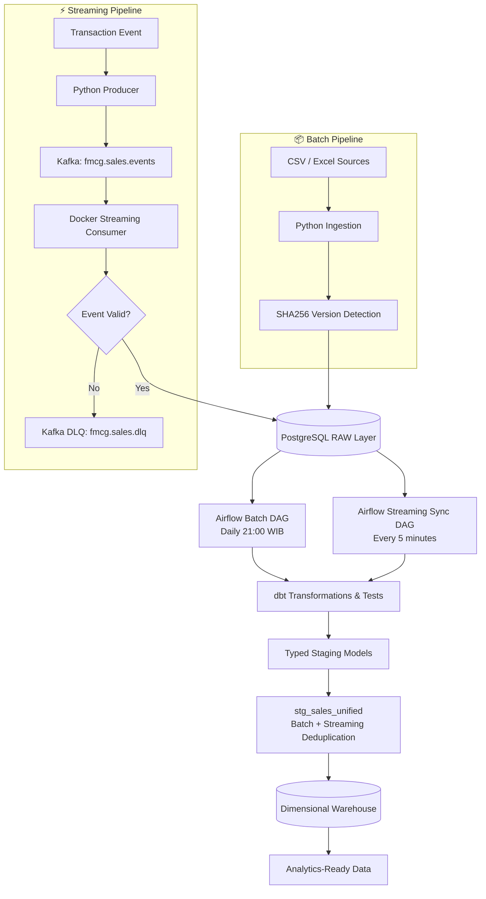
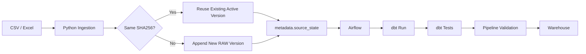
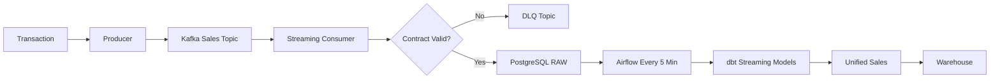
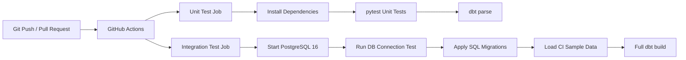

🏗️ FMCG Batch & Streaming Data Engineering Platform
<p align="center">
  End-to-end portfolio project that combines <b>batch ingestion</b>, <b>Kafka streaming</b>, <b>Airflow orchestration</b>, <b>dbt transformations</b>, <b>PostgreSQL warehousing</b>, and <b>GitHub Actions CI</b> for an FMCG sales domain.
</p>
<p align="center">
  <a href="https://github.com/andikahfi98/fmcg-data-engineering-platform/actions/workflows/ci.yml">
    
  </a>
  
  
  
  
  
  
</p>
---
📌 Project Overview
This project builds a production-inspired FMCG data platform with two ingestion paths:
Batch pipeline for periodic CSV and Excel sources.
Streaming pipeline for near-real-time sales transaction events through Kafka.
Both paths land in PostgreSQL, are transformed and tested with dbt, and converge into a dimensional warehouse. Airflow orchestrates scheduled downstream processing, while GitHub Actions validates the codebase and warehouse build on every push or pull request.
The project is designed to demonstrate practical Data Engineering concepts such as idempotency, source versioning, data contracts, DLQ handling, deduplication, orchestration, dimensional modeling, observability, and CI integration testing.
---
🧭 Architecture

Why both batch and streaming?
The two paths solve different business needs:
Kafka streaming provides fast visibility into new transactions.
Batch data can represent periodic reconciliation, backfill, corrections, or official source-system extracts.
`stg_sales_unified` merges both sources and prevents double counting by using the sales business grain `invoice_id + product_id`.
---
🔄 Workflow
1️⃣ Batch Workflow

The batch ingestion layer is version-aware and idempotent. Reprocessing an unchanged file does not create duplicate RAW rows, while a changed file is stored as a new version.
2️⃣ Streaming Workflow

The Kafka consumer runs continuously as a Docker service. Valid events are persisted to PostgreSQL; invalid data is routed to a Dead Letter Queue without stopping the consumer.
3️⃣ CI Workflow

---
🛠️ Tech Stack
Layer	Technology	Purpose
Language	🐍 Python 3.12	Ingestion, streaming producer/consumer, validation
Database	🐘 PostgreSQL 16	RAW, staging, warehouse, metadata
Transformation	🧱 dbt	Typed staging, dimensional models, tests
Orchestration	🌬️ Apache Airflow	Batch and micro-batch scheduling
Streaming	📨 Apache Kafka	Transaction event streaming and DLQ
Containers	🐳 Docker Compose	Reproducible local infrastructure
Testing	🧪 pytest + dbt tests	Unit, integration, and data quality validation
CI	⚙️ GitHub Actions	Automated validation on push / PR
Version Control	🌿 Git + GitHub	Source control and project delivery
---
📊 Dataset at a Glance
The local batch dataset contains:
Dataset	Records
Sales Transactions	130,995
Inventory	19,440
Sales Targets	1,152
Outlets	4,000
Products	45
Distributors	18
Salespeople	48
The source data is intentionally excluded from Git. Only reproducible CI fixtures are committed.
---
🗄️ Data Layers
RAW
The RAW layer preserves source fidelity and lineage. Business fields are intentionally permissive where appropriate so data quality rules are enforced downstream rather than silently changing source values during landing.
Examples:
`raw.sales`
`raw.product`
`raw.distributor`
`raw.salesperson`
`raw.outlet`
`raw.target`
`raw.inventory`
`raw.sales_streaming_events`
Staging
Staging models clean, cast, standardize, and validate RAW data.
Examples:
`stg_sales`
`stg_sales_streaming`
`stg_sales_unified`
`stg_product`
`stg_distributor`
`stg_salesperson`
`stg_outlet`
`stg_target`
`stg_inventory`
Warehouse
The final warehouse follows a dimensional model.
Dimensions
`dim_date`
`dim_product`
`dim_distributor`
`dim_salesperson`
`dim_outlet`
Facts
`fact_sales`
`fact_inventory`
`fact_sales_target`
---
🧠 Key Engineering Decisions
🔐 Version-aware batch ingestion
Each source file is fingerprinted using SHA256. Successful versions are stored in pipeline metadata, while `metadata.source_state` identifies the active version used by downstream models.
This supports:
unchanged-file detection,
append-only RAW history,
source rollback/reactivation,
idempotent reprocessing.
🔀 Batch + streaming deduplication
Sales from batch and Kafka are merged in `stg_sales_unified` at the business grain:
```text
invoice_id + product_id
```
When the same transaction exists in both sources, streaming data receives higher priority so the warehouse contains only one business record.
📨 Reliable Kafka consumption
The streaming consumer implements:
event contract validation,
manual Kafka offset commits,
PostgreSQL commit before offset commit,
duplicate protection,
Dead Letter Queue routing,
separation of data errors and system errors.
A system failure does not commit the Kafka offset, allowing the event to be retried after recovery.
🧪 Data quality as code
dbt tests validate keys, relationships, required fields, model grain, row reconciliation, and inventory balance. Pipeline validation additionally compares RAW, staging, unified, and warehouse counts.
---
🌬️ Airflow Orchestration
`fmcg_batch_pipeline`
Runs daily at 21:00 WIB.
```text
ingest_fact_sales
      ↓
ingest_master_data
      ↓
dbt_run
      ↓
dbt_test
      ↓
validate_pipeline
      ↓
pipeline_complete
```
`fmcg_streaming_sync`
Runs every 5 minutes.
```text
dbt_streaming_build
      ↓
validate_pipeline
      ↓
streaming_sync_complete
```
Kafka ingestion itself is not scheduled by Airflow. The Kafka consumer is a long-running Docker service, while Airflow handles scheduled downstream warehouse synchronization.
---
🛡️ Streaming Reliability
Scenario	Behavior
Valid event	Insert into PostgreSQL RAW, then commit Kafka offset
Invalid event structure	Send to DLQ, then commit source offset
Invalid numeric/business value	Send to DLQ
Duplicate event	Ignore duplicate RAW insert safely
PostgreSQL / system failure	Rollback and do not commit Kafka offset
Consumer restart	Continue from committed Kafka offset
Kafka topics:
```text
fmcg.sales.events
fmcg.sales.dlq
```
---
🧪 Automated Testing & CI
The repository includes both unit and integration testing.
Unit CI
Python streaming contract tests
dbt project parsing
Integration CI
GitHub Actions starts a clean PostgreSQL 16 service and then:
validates database connectivity,
applies SQL migrations,
loads minimal relationally-consistent CI sample data,
runs a full `dbt build`,
fails the workflow if a model or data test fails.
This validates that the warehouse can be rebuilt from a clean database rather than relying only on the developer's local environment.
---
📁 Project Structure
```text
fmcg-data-engineering-platform/
│
├── .github/
│   └── workflows/
│       └── ci.yml
│
├── airflow/
│   ├── dags/
│   │   ├── fmcg_batch_pipeline.py
│   │   └── fmcg_streaming_sync.py
│   ├── Dockerfile
│   └── requirements.txt
│
├── data/
│   ├── source/              # ignored source data
│   ├── raw/
│   └── sample/
│
├── dbt/
│   ├── macros/
│   ├── models/
│   │   ├── staging/
│   │   └── marts/
│   ├── tests/
│   ├── dbt_project.yml
│   └── profiles.yml
│
├── docker/
│   └── streaming/
│       ├── Dockerfile
│       └── requirements.txt
│
├── docs/
│   └── Documentation/
│
├── scripts/
│   └── run_batch_pipeline.sh
│
├── sql/
│   └── ddl/                 # numbered database migrations
│
├── src/
│   ├── ingestion/
│   ├── maintenance/
│   ├── monitoring/
│   ├── profiling/
│   ├── streaming/
│   ├── utils/
│   └── validation/
│
├── tests/
│   ├── fixtures/
│   ├── test_db_connection.py
│   └── test_streaming_validation.py
│
├── .env.example
├── .gitignore
├── docker-compose.yml
├── pytest.ini
├── requirements.txt
├── requirements-dev.txt
└── README.md
```
---
🚀 Getting Started
Prerequisites
Git
Python 3.12
Docker Desktop / Docker Engine
Docker Compose
WSL2 or Linux-compatible shell recommended
1. Clone the repository
```bash
git clone git@github.com:andikahfi98/fmcg-data-engineering-platform.git
cd fmcg-data-engineering-platform
```
2. Create the Python environment
```bash
python3 -m venv .venv
source .venv/bin/activate
pip install -r requirements-dev.txt
```
3. Configure environment variables
```bash
cp .env.example .env
```
Update `.env` with your local database settings. Never commit `.env`.
4. Start the platform
```bash
docker compose up -d --build
```
5. Apply database migrations
```bash
for file in sql/ddl/*.sql; do
  docker compose exec -T postgres sh -lc \
    'psql -v ON_ERROR_STOP=1 -U "$POSTGRES_USER" -d "$POSTGRES_DB"' \
    < "$file"
done
```
6. Create Kafka topics
```bash
docker compose exec kafka \
  /opt/kafka/bin/kafka-topics.sh \
  --bootstrap-server kafka:19092 \
  --create \
  --if-not-exists \
  --topic fmcg.sales.events \
  --partitions 3 \
  --replication-factor 1
```
```bash
docker compose exec kafka \
  /opt/kafka/bin/kafka-topics.sh \
  --bootstrap-server kafka:19092 \
  --create \
  --if-not-exists \
  --topic fmcg.sales.dlq \
  --partitions 3 \
  --replication-factor 1
```
7. Run the batch pipeline locally
```bash
bash scripts/run_batch_pipeline.sh
```
8. Run dbt manually
```bash
dbt build \
  --project-dir dbt \
  --profiles-dir dbt
```
9. Run tests
Unit tests:
```bash
pytest -v -m "not integration"
```
Integration tests with PostgreSQL running:
```bash
pytest -v -m integration
```
10. Test a streaming transaction
The streaming consumer runs automatically through Docker Compose.
```bash
python -m src.streaming.produce_test_sales_event
```
The event flows through Kafka → PostgreSQL RAW → scheduled Airflow streaming sync → dbt → warehouse.
---
📈 Results
The implemented platform successfully demonstrates:
✅ 130,995 batch sales transactions processed without duplication
✅ Version-aware batch ingestion using SHA256
✅ Automated batch orchestration with Airflow
✅ Kafka-based transaction streaming
✅ Always-on Docker Kafka consumer
✅ Dead Letter Queue handling for invalid events
✅ Idempotent and duplicate-safe streaming ingestion
✅ Batch + streaming deduplication before the warehouse
✅ Dimensional warehouse with facts and dimensions
✅ dbt data quality and reconciliation tests
✅ Automated PostgreSQL integration testing
✅ Full warehouse `dbt build` in GitHub Actions
---
📸 Execution Evidence
GitHub Actions — End-to-End CI
<p align="center">
  
</p>
<p align="center">
  
</p>
---
🔭 Possible Next Improvements
Kafka Schema Registry / formal schema evolution
CDC ingestion from operational databases
Centralized metrics and alerting
Stream processing with Flink or Spark Structured Streaming
Cloud deployment and managed warehouse target
Infrastructure as Code
---
👤 Author
Andi Kahfi  
Data Analyst transitioning deeper into Data Engineering through hands-on, production-inspired portfolio projects.
GitHub: @andikahfi98
---
<p align="center">
  ⭐ If you find this project useful, feel free to explore the repository and its implementation details.
</p>