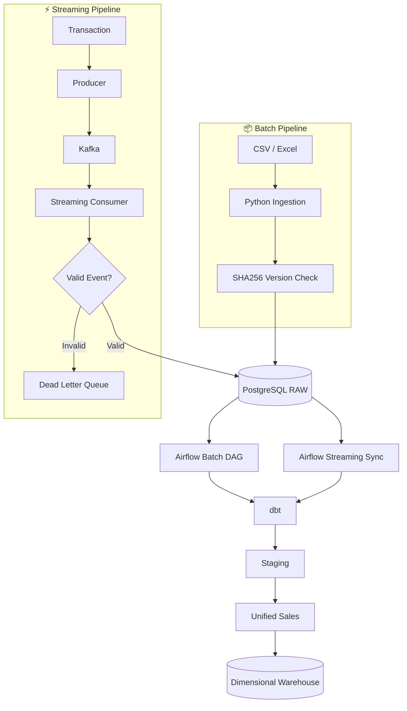
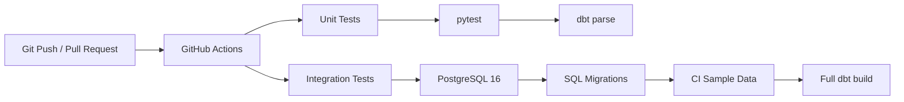

# 🏗️ FMCG Batch & Streaming Data Engineering Platform

<p align="center">
  End-to-end Data Engineering project combining <b>batch processing</b>,
  <b>Kafka streaming</b>, <b>Airflow orchestration</b>,
  <b>dbt transformations</b>, and a <b>PostgreSQL data warehouse</b>.
</p>

<p align="center">
  <a href="https://github.com/andikahfi98/fmcg-data-engineering-platform/actions/workflows/ci.yml">
    
  </a>
  
  
  
  
  
  
</p>

---

## 📌 Project Overview

This project simulates an FMCG data platform with **two data ingestion paths**:

- 📦 **Batch** — sales and master data from CSV / Excel files
- ⚡ **Streaming** — near-real-time sales transactions through Kafka

Both pipelines eventually feed the same PostgreSQL dimensional warehouse.

The project demonstrates:

- Batch ingestion
- Streaming ingestion
- File version detection
- Idempotent processing
- Data validation
- Dead Letter Queue
- Batch + streaming deduplication
- Airflow orchestration
- dbt transformations and testing
- Dimensional modeling
- Automated CI testing

---

# 🧭 Architecture



---

# 📦 Batch Pipeline

## Data Sources

The batch pipeline uses sales CSV files and an Excel master-data workbook.

```text
FactSales_2025_Q1.csv
FactSales_2025_Q2.csv
...
FactSales_2026_Q4.csv

KopDes_MasterData.xlsx
├── DimProduct
├── DimDistributor
├── DimSalesperson
├── DimOutlet
├── FactTarget
└── FactInventory
```

## Workflow

```text
CSV / Excel
     ↓
Python Ingestion
     ↓
SHA256 File Check
     ↓
PostgreSQL RAW
     ↓
Airflow
     ↓
dbt Staging + Tests
     ↓
Unified Sales
     ↓
Warehouse
```

## 🔄 How Batch Updates Work

Every source file receives a SHA256 fingerprint.

### Same file

```text
Old SHA256 = New SHA256
        ↓
      SKIP
```

The file is not loaded again.

### Changed file

```text
Old SHA256 ≠ New SHA256
        ↓
Append new RAW version
```

The previous RAW version is kept for history.

`metadata.source_state` determines which version is currently active.

This makes the ingestion process **idempotent and version-aware**.

---

# ⚡ Streaming Pipeline

In this project, a Python producer simulates transactions coming from a real application, POS system, or order system.

## Workflow

```text
Transaction
     ↓
Python Producer
     ↓
Kafka
fmcg.sales.events
     ↓
Docker Consumer
     ↓
Event Validation
   /          \
Valid        Invalid
  ↓             ↓
PostgreSQL     DLQ
RAW            fmcg.sales.dlq
  ↓
Airflow every 5 minutes
  ↓
dbt
  ↓
Unified Sales
  ↓
Warehouse
```

## 🔄 How Streaming Updates Work

1. A transaction is created.
2. The producer sends the event to Kafka.
3. The always-running consumer reads the event.
4. The event is validated.
5. Valid events are inserted into PostgreSQL RAW.
6. Invalid events are sent to the Dead Letter Queue.
7. Airflow runs the streaming sync every 5 minutes.
8. dbt transforms the new data.
9. The warehouse is refreshed.

Kafka ingestion is therefore **near real-time**, while warehouse processing uses a **5-minute micro-batch**.

---

# 🔀 Batch + Streaming Deduplication

Sales from both pipelines meet in:

```text
stg_sales_unified
```

The sales business grain is:

```text
invoice_id + product_id
```

Example:

```text
Batch
INV001 + P001

Streaming
INV001 + P001
```

Without deduplication:

```text
2 rows ❌
```

With `stg_sales_unified`:

```text
1 business record ✅
```

This prevents double counting before data reaches:

```text
warehouse.fact_sales
```

---

# 🌬️ Airflow Orchestration

The project contains two Airflow DAGs.

## 📦 Batch DAG

Runs daily.

```text
ingest_fact_sales
       ↓
ingest_master_data
       ↓
dbt_run
       ↓
dbt_test
       ↓
validate_pipeline
       ↓
pipeline_complete
```

## ⚡ Streaming Sync DAG

Runs every 5 minutes.

```text
dbt_streaming_build
       ↓
validate_pipeline
       ↓
streaming_sync_complete
```

> Kafka consumption itself is not handled by Airflow.

The Kafka consumer runs continuously as a Docker service, while Airflow handles scheduled downstream processing.

---

# 🗄️ Data Architecture

The platform uses three main data layers.

## 1. RAW

Stores source data and ingestion lineage.

Examples:

```text
raw.sales
raw.product
raw.distributor
raw.salesperson
raw.outlet
raw.target
raw.inventory
raw.sales_streaming_events
```

## 2. Staging

dbt cleans, casts, standardizes, and validates RAW data.

Important models:

```text
stg_sales
stg_sales_streaming
stg_sales_unified
stg_product
stg_distributor
stg_salesperson
stg_outlet
stg_target
stg_inventory
```

## 3. Warehouse

The final layer uses a dimensional model.

### Dimensions

```text
dim_date
dim_product
dim_distributor
dim_salesperson
dim_outlet
```

### Facts

```text
fact_sales
fact_inventory
fact_sales_target
```

---

# 🛡️ Streaming Reliability

The Kafka consumer includes several reliability controls.

| Scenario | Action |
|---|---|
| Valid event | Insert into PostgreSQL |
| Invalid event | Send to DLQ |
| Invalid datatype | Send to DLQ |
| Duplicate event | Ignore duplicate insert safely |
| PostgreSQL failure | Rollback |
| System failure | Kafka offset is not committed |
| Consumer restart | Continue from committed offset |

Kafka topics:

```text
fmcg.sales.events
fmcg.sales.dlq
```

The consumer commits the Kafka offset **only after successful processing**.

---

# 🧪 Testing & CI

Every push or pull request triggers GitHub Actions.



## Unit CI

Checks:

- Python streaming validation
- Event contract rules
- dbt project parsing

## Integration CI

GitHub Actions creates a clean PostgreSQL instance and then:

```text
Start PostgreSQL
      ↓
Test DB Connection
      ↓
Apply SQL Migrations
      ↓
Load CI Sample Data
      ↓
Full dbt Build
      ↓
PASS / FAIL
```

This verifies that the warehouse can be rebuilt from a clean environment.

---

# 🛠️ Tech Stack

| Area | Technology |
|---|---|
| Programming | 🐍 Python |
| Database | 🐘 PostgreSQL |
| Transformation | 🧱 dbt |
| Orchestration | 🌬️ Apache Airflow |
| Streaming | 📨 Apache Kafka |
| Containers | 🐳 Docker Compose |
| Testing | 🧪 pytest + dbt tests |
| CI | ⚙️ GitHub Actions |
| Version Control | 🌿 Git + GitHub |

---

# 📊 Dataset

Development dataset:

| Dataset | Rows |
|---|---:|
| Sales Transactions | 130,995 |
| Inventory | 19,440 |
| Sales Targets | 1,152 |
| Outlets | 4,000 |
| Products | 45 |
| Distributors | 18 |
| Salespeople | 48 |

Raw source files are intentionally excluded from Git.

Only small CI fixtures required for automated testing are committed.

---

# 📁 Project Structure

```text
fmcg-data-engineering-platform/
│
├── .github/
│   └── workflows/
│       └── ci.yml
│
├── airflow/
│   └── dags/
│       ├── fmcg_batch_pipeline.py
│       └── fmcg_streaming_sync.py
│
├── data/
│   ├── source/
│   ├── raw/
│   └── sample/
│
├── dbt/
│   ├── models/
│   │   ├── staging/
│   │   └── marts/
│   └── tests/
│
├── docker/
│   └── streaming/
│
├── docs/
│
├── scripts/
│
├── sql/
│   └── ddl/
│
├── src/
│   ├── ingestion/
│   ├── monitoring/
│   ├── streaming/
│   └── utils/
│
├── tests/
│   └── fixtures/
│
├── docker-compose.yml
├── requirements.txt
├── requirements-dev.txt
└── README.md
```

---

# 🚀 Quick Start

## 1. Clone Repository

```bash
git clone git@github.com:andikahfi98/fmcg-data-engineering-platform.git

cd fmcg-data-engineering-platform
```

## 2. Create Python Environment

```bash
python3 -m venv .venv

source .venv/bin/activate

pip install -r requirements-dev.txt
```

## 3. Configure Environment

```bash
cp .env.example .env
```

Update the local configuration inside `.env`.

Never commit `.env`.

## 4. Start Infrastructure

```bash
docker compose up -d --build
```

Services include:

```text
PostgreSQL
Airflow
Kafka
Streaming Consumer
```

## 5. Run Batch Pipeline

```bash
bash scripts/run_batch_pipeline.sh
```

## 6. Run dbt

```bash
dbt build \
  --project-dir dbt \
  --profiles-dir dbt
```

## 7. Run Tests

```bash
pytest -v
```

---

# ✅ What Was Implemented

- ✅ 130,995 batch sales transactions
- ✅ Multi-file batch ingestion
- ✅ SHA256 source version detection
- ✅ Idempotent batch processing
- ✅ PostgreSQL RAW layer
- ✅ Kafka transaction streaming
- ✅ Always-running Docker consumer
- ✅ Event contract validation
- ✅ Dead Letter Queue
- ✅ Duplicate-safe streaming ingestion
- ✅ Batch + streaming deduplication
- ✅ Airflow batch orchestration
- ✅ Airflow streaming micro-batch sync
- ✅ dbt staging models
- ✅ Dimensional warehouse
- ✅ Data quality tests
- ✅ Pipeline reconciliation
- ✅ Python unit testing
- ✅ PostgreSQL integration testing
- ✅ Full dbt build through GitHub Actions

---

# 📸 Execution Evidence

## GitHub Actions

<p align="center">
  
</p>

<p align="center">
  
</p>

---

# 👤 Author

**Andi Kahfi**

Data Analyst expanding into Data Engineering through hands-on, production-inspired projects.

GitHub: [@andikahfi98](https://github.com/andikahfi98)

---

<p align="center">
  ⭐ FMCG Batch & Streaming Data Engineering Platform
</p>